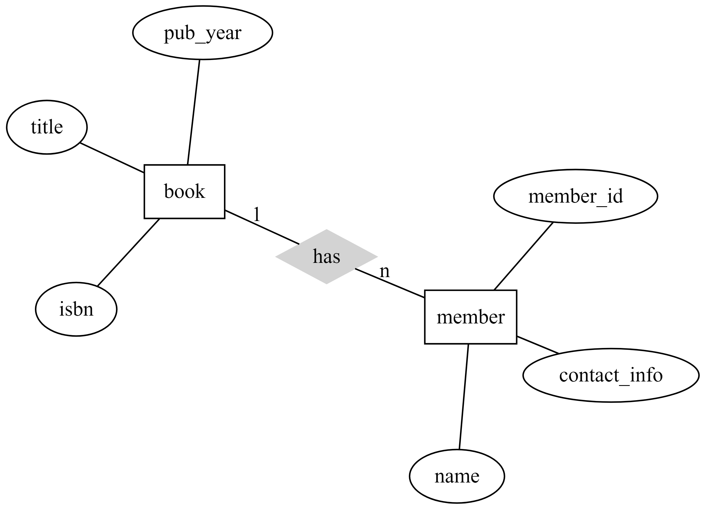
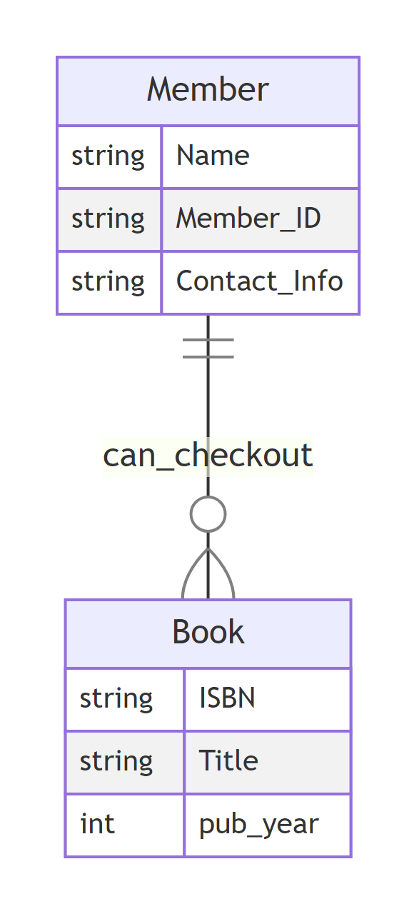

# Welcome to Homework 2
(Ben Fenuku)
2023-09-01

This is my solution to homework 2. I’m using Quarto render this document
from a QMD file to a regular MD file for display on GITHUB.

## Scenario

Imagine you’re designing a Library Management System for a small local
library. The system needs to track information about books and library
members. Each book has a unique ISBN (International Standard Book
Number), a title, and a publication year. Each library member is
identified by a unique member ID, and the system needs to store their
name and contact information. Library members can check out books, but
they don’t have to.

## Design Task 1

Identify and document the entities, attributes, and relationships using
Chen notation.

## Design Task 2

Identify and document the entities, attributes, and relationships using
Crow’s Foot notation.

